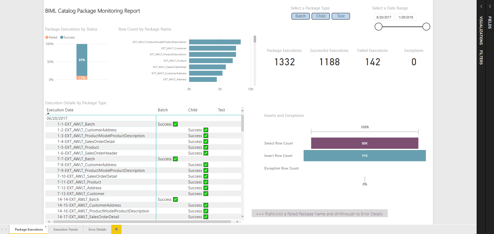
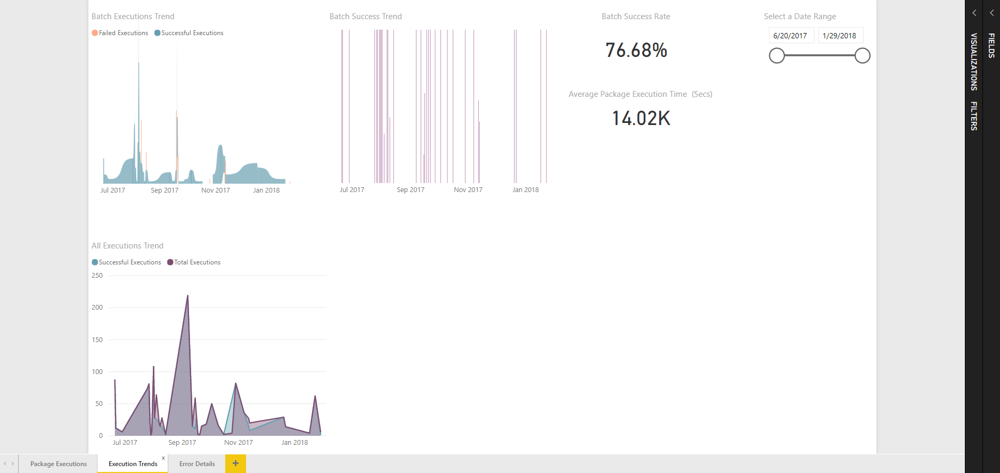
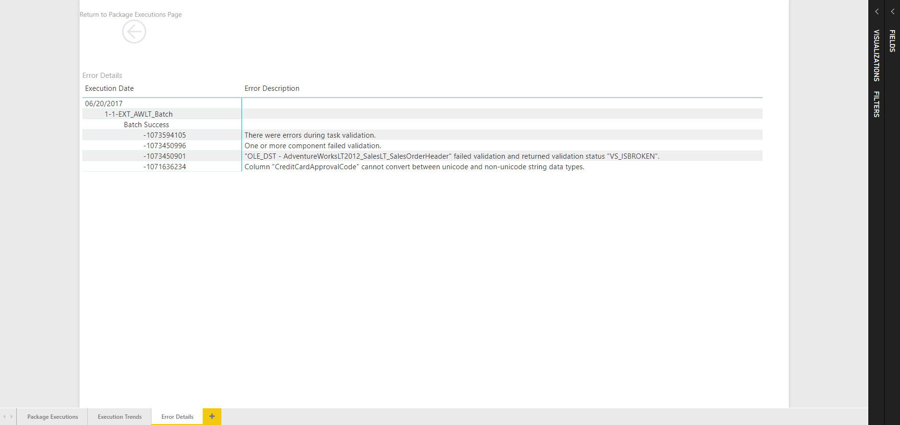

# BimlCatalog Power BI Execution Monitoring Dashboard

The `BimlCatalogExecutionMonitoring.pbix` Power BI file provides a dashboard for executions logged in the BimlCatalog database.

This Power BI Dashboard was provided to the BimlCatalog project by:

> **BitQ**  
> Transforming Business Data into Intelligent Data  
> [www.bitq.com.au](https://www.bitq.com.au)

It provides 3 tabs for reviewing execution data:

* Package Executions
* Execution Trends
* Error Details

## Package Executions

Shows an overview and drill through options for executions.

## Execution Trends

Shows trends for executions.

## Error Details

Shows details for errors.

## Connecting to a BimlCatalog instance

The Power BI file has an embedded connection to the BimlCatalog database.

Update the connection to point to the BimlCatalog from where reporting data should be extracted and refresh the data.
